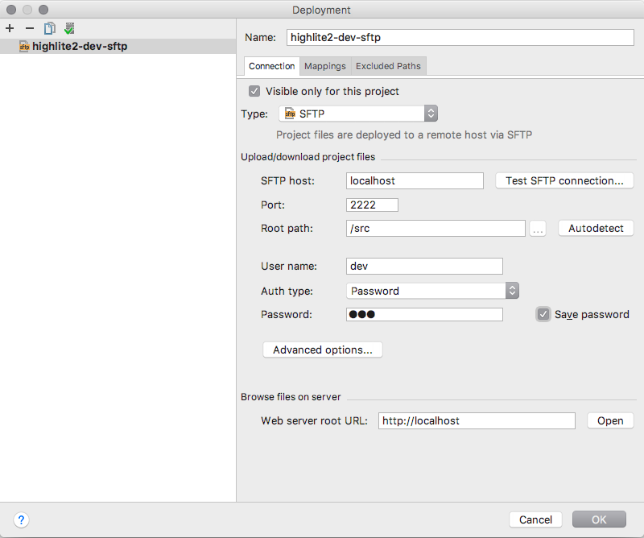
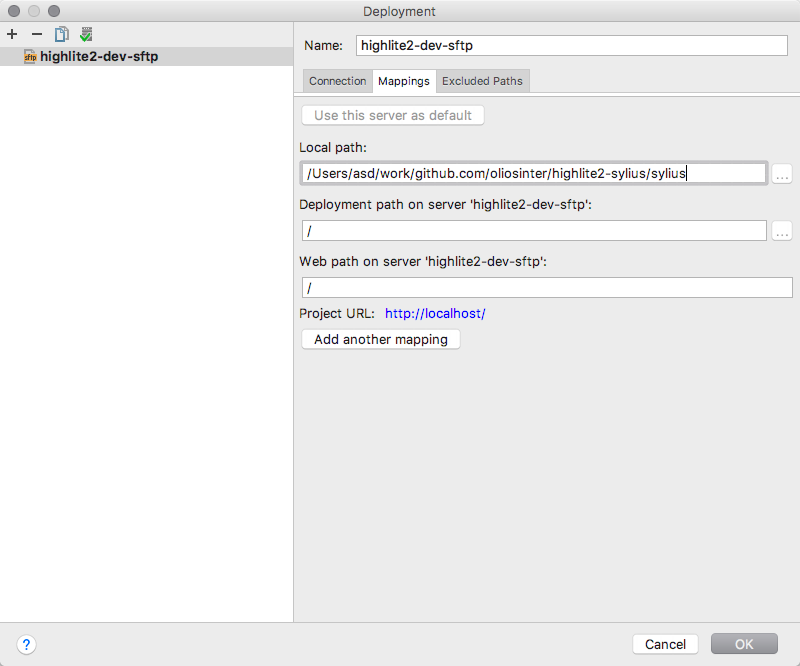

## Highlite Spb

[Highlite Spb](http://highlite-spb.ru) is a show equipment store. It is a eCommerce project, consisting of two parts:
- [**highlite2-sylius**](https://github.com/oliosinter/highlite2-sylius) - online store, based on [Sylius](https://sylius.com) eCommerce framework;
- [**highlite2-import**](https://github.com/oliosinter/highlite2-import) - product import tool, written in Golang. 

## Highlite2-Sylius
**Highlite2-sylius** is based on [Sylius Standard Edition](https://github.com/Sylius/Sylius-Standard).

### Project structure
- `ci/` release/deploy scripts;
- `dev/` local development environment setup;
- `docs/` documentation files;
- `sylius/` Sylius Standard Edition.

### Local Development

#### Requirements:
In order to run **highlite2-sylius** locally you need to have `docker` and `docker-compose` installed. 

#### Commands:
|Command|Description|
|---:|---|
|`make dev-build`    | Builds local environment from scratch. You must use this command when you start local environment for the first time or when you want to fully recreate it. |
|`make dev-restart`  | Rebuilds php-fpm, nginx and sftp containers. Keeps untouched the database and media files. |
|`make dev-start`    | Starts the environment after it had been stopped by `make dev-stop` command. |
|`make dev-stop`     | Stops local environment. You can easily start it again with `make dev-start` command. |
|`make dev-clean`    | Totally removes local environment, but keeps untouched composer cache volume. |
|`make dev-bash-node`| Runs `bash` in a container with node and yarn installed, with mounted codebase volume and under `www-data` user. |
|`make dev-bash-php` | Runs `bash` in a container with php and composer installed, with mounted codebase volume and under `www-data` user. |

Project codebase from `sylius` folder is placed in a volume. All services that need to have access to the codebase mount project folder to that volume.
In order to develop locally and to update your code in a real time there is a sftp container, that also mounts to the codebase volume. You can setup
automatic deployment using following credentials:
- **hostname** localhost
- **port** 2222
- **user** dev
- **password** dev

##### PHPStorm deployment settings example
###### Connection

###### Mappings
